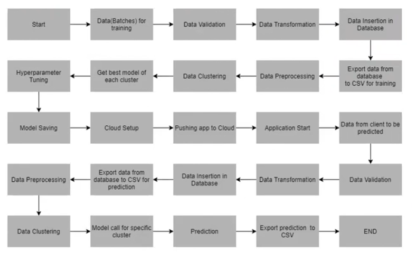

# WAFER FAULT DETECTION
 => OBJECTIVE OF THE PROJECT
 + This project builds a classifiction methodology to predict the quality of wafer sensors based on the gicen training data. It helps in identifying the perticular wafer that is faulty so that it can be replaced without disturbing whole production line. Based on the prediction the alarm palced by the client will notify and then the faulty wafer can be replaced by stopping that perticular section of work. 
 
 

 
 + Data Ingestion 
 + Data Preprocessing 
 + Model Selection 
 + Model Tuning
 + Predction
 + Logging Framework
 + Deployment 
 + Model Retraning 
 
 Data:
 
 
 
 => HOW TO RUN THE PROJECT
 
    + Clone this repository
    + Create a new environment conda create -n newenv python==3.6
    + Open any IDE
    + Install the requirements.txt file pip install -r requirements.txt
    + After all the requirements are installed successfully Then run the app by python app.py

